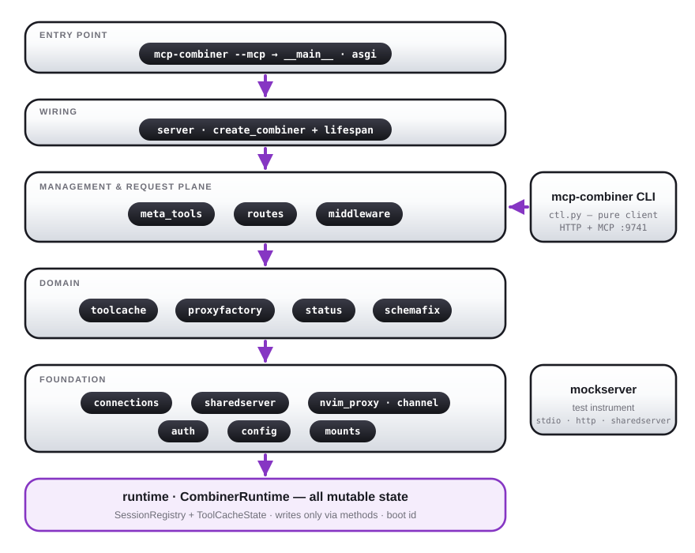

# mcp-companion.nvim — Design Notes

## Background

[mcphub.nvim](https://github.com/ravibrock/mcphub.nvim) was abandoned. It used a Node.js
`mcp-hub` process as a combiner and a dedicated Lua plugin. This project replaces both.

The goal: a modern, maintainable MCP integration for Neovim that works with CodeCompanion,
supports ACP agents like OpenCode, and doesn't depend on abandoned Node.js infrastructure.

## Option B: Python FastMCP Combiner

We chose a Python [FastMCP](https://github.com/jlowin/fastmcp) combiner over maintaining a
Node.js hub, because:

- FastMCP has a stable, maintained Python SDK
- uv makes the venv trivially reproducible
- Python is easier to extend than the abandoned mcp-hub

(The combiner originally ran `stateless_http=True` to dodge session-corruption
issues — FastMCP #823/#945. It now runs **stateful** streamable HTTP
(`stateless_http=False`), which is required for the GET/SSE notification
stream that OpenCode and the Lua client consume.)

The combiner is a FastMCP server that proxies all configured MCP servers via the
`everything` mount pattern. It exposes them all on a single HTTP endpoint at
`http://127.0.0.1:<port>/mcp`.

## Combiner Process Lifecycle

The combiner is a long-running process. Multiple Neovim instances should share one combiner
rather than each starting their own.

We use [sharedserver](https://github.com/georgeharker/sharedserver) for this. It is a
Neovim Lua plugin with a Rust CLI backend that manages process lifecycle with reference
counting: the process starts when the first instance registers, and stops after the last
instance deregisters plus an idle timeout.

Fallback: if sharedserver is not available, the combiner starts directly via `vim.uv` and
lives for the lifetime of the Neovim instance.

## HTTP Client Design

The Lua HTTP client (`combiner/client.lua`) uses `vim.uv.new_tcp()` — one TCP connection
per *request* (`Connection: close`, forcing immediate body delivery), plus **one
long-lived SSE stream** (`GET /mcp`) for server-push notifications
(`tools/resources/prompts list_changed`). The SSE stream reconnects with a fixed
2s backoff and shuts down gracefully (FIN, not RST) so it never corrupts FastMCP's
session state; a 30s polling timer remains as a fallback refresh path.

Sessions are stateful: every request carries `Mcp-Session-Id`, and per-chat
clients additionally carry the chat token (`X-MCP-Combiner-Session` header
and/or `/mcp/<token>` URL).

## Tool Naming

FastMCP uses `_` as the namespace separator when mounting servers. A tool named `get_me`
on a server named `github` becomes `github_get_me` in the combiner namespace.

The Lua client splits on the first `_` to recover the server name and display name:
- `github_get_me` → server `github`, display `get_me`
- `clickup_clickup_search` → server `clickup`, display `clickup_search`

Both names are stored per tool:
- `tool._namespaced`: full combiner name (used for MCP calls)
- `tool._display`: stripped name (used for CC tool key suffix)

CC tool keys use double underscore: `server__display` (e.g. `github__get_me`,
`clickup__clickup_search`).

## CodeCompanion Integration

CC has a tools API (`config.interactions.chat.tools`) where tools can be registered
with an `id`, `description`, and `callback`. The callback returns a command spec that
CC executes and streams back to the chat.

Our `cc/tools.lua` writes directly into the live `cc_config.interactions.chat.tools`
table. A fingerprint cache (tool count + sorted namespaced names) prevents redundant
re-registration on every poll cycle.

### Why not CC's native MCP client?

CC has its own MCP client subsystem. If we added the combiner to `cc_config.mcp.servers`
and `default_servers`, CC would:

1. Auto-start the combiner as a stdio MCP client on every Neovim startup
2. Prefix all tool names with `mcp-combiner_` (e.g. `mcp-combiner_github_get_me`)
3. Double-register all 180 tools alongside our correctly-named registrations

So we bypass CC's MCP client entirely and register tools ourselves via the tools API.

## ACP Forwarding

ACP (Agent Client Protocol) is the protocol CodeCompanion uses to communicate with
external AI agents like OpenCode and Claude Code. The `session/new` method accepts a
`mcpServers` array of MCP server connection details.

When an ACP session is established, we inject the combiner into `mcpServers` so the
agent can connect to it directly and call tools autonomously. The agent discovers all
tools by querying the combiner's MCP endpoint.

### Transport

The ACP spec supports three transports in `mcpServers`:
- **stdio** (required): `{ name, command, args, env[] }`
- **HTTP** (optional, requires `mcpCapabilities.http: true` in initialize): `{ type: "http", name, url, headers[] }`
- **SSE** (deprecated)

OpenCode advertises `mcpCapabilities: { http: true, sse: true }`, so we use HTTP:
`{ type = "http", name = "mcp-combiner", url = "http://127.0.0.1:9741/mcp", headers = {} }`.

If the agent does not support HTTP, we fall back to stdio via `mcp-remote`:
`{ name = "mcp-combiner", command = "npx", args = { "-y", "mcp-remote", url }, env = {} }`.

### Monkey-patch approach

CC's stock MCP plumbing can't inject a per-session HTTP server entry, so
`cc/init.lua` patches two seams at setup:

1. **ACP**: `codecompanion.mcp.transform_to_acp` is wrapped to append the
   combiner `mcpServers` entry (built by `build_combiner_entry`) into the ACP
   session, carrying the chat token in the header and/or `/mcp/<token>` URL
   (`combiner.token_in_url` tri-state; the stdio `mcp-remote` fallback always
   uses the URL since it forwards neither env nor headers).
2. **CLI agents**: `codecompanion.interactions.cli.create` is wrapped so the
   spawned agent runs under `env MCP_COMPANION_COMBINER_URL=http://…/mcp/<token>`,
   scoped to that spawn.

Each chat's token is minted in the corresponding `*Pre` autocmd; per-chat
`allowed_servers` filters are POSTed to `/sessions/token/<token>/filter`
(`combiner/sessions.lua`).

## Data Flow

### CC chat tool call

```
User types prompt → LLM decides to call tool
  → CC calls tool callback in cc/tools.lua
    → callback invokes combiner.client:call_tool(namespaced_name, args)
      → HTTP POST /mcp (JSON-RPC tools/call)
        → combiner proxies to real MCP server
          → result returned to CC → shown in chat
```

### ACP (OpenCode) tool call

```
User types prompt in OpenCode chat
  → OpenCode's LLM decides to call tool
    → OpenCode makes HTTP call directly to combiner
      → combiner proxies to real MCP server
        → result returned to OpenCode
          → shown in OpenCode chat
```

Note: for ACP sessions, tool calls bypass CC entirely. CC only establishes the session
and forwards prompts; OpenCode handles tool execution independently.

## State Management

`state.lua` maintains the canonical view of combiner state:
- `connected`: bool
- `servers`: array of server objects, each with `name`, `tools[]`, `resources[]`, `prompts[]`
- Each tool has `_namespaced`, `_display`, `name`, `description`, `inputSchema`

State is updated by `combiner/client.lua` after each capability refresh. Subscribers
receive events via `state.on(event, callback)`.

## Per-Chat Session Filtering

Each CC chat session gets its own MCP session on the combiner, identified by a UUID token.
The combiner can disable individual servers per-session so a chat only sees the servers
it is allowed to use.

- **ACP adapters**: token injected into the `mcpServers` URL (`/mcp/<token>`), filter
  applied via `POST /sessions/token/<token>/filter` in `ACPSessionPost`.
- **HTTP adapters**: a lightweight "lite" per-chat MCP client connects to `/mcp/<token>`;
  filter applied immediately after connect; tool calls routed through the per-chat client.
- `/mcp-session` slash command toggles servers for the current chat using the same
  token endpoint for both adapter types.

For full implementation details see
[`docs/designs/per-chat-session-filtering.md`](designs/per-chat-session-filtering.md).

## Combiner Internal Architecture

The Python combiner was decomposed (2026-07) from a single `server.py` god
module into focused modules with a one-way dependency DAG. Management (the
`combiner__*` meta-tools, the session/health REST API, and the `mcp-combiner`
control CLI) sits in a distinct band above the domain modules and below only
the wiring:

<p align="center">
  
</p>


Key properties:

- **`runtime.CombinerRuntime`** owns all mutable state (`SessionRegistry`,
  `ToolCacheState`, late-bound config/manager refs, the boot id). All *writes*
  go through its methods; the old `server.py` globals survive only as
  read-compat aliases for tests.
- **Entry point**: `mcp-combiner <command>` is a control CLI (`ctl.py`,
  httpx REST + short-lived fastmcp sessions); `mcp-combiner --mcp --config …`
  serves. Bare `--config` still serves with a deprecation warning. `start` /
  `stop` / `restart` are the exception to "control an already-running combiner":
  they refcount the combiner's *own* process via sharedserver (`use` / `unuse` /
  `admin stop --force` + `use`), tied to the calling shell's PID — the native-CLI
  equivalent of the Claude plugin's `start.sh` hook. `restart` mirrors
  `:MCPRestart` (refcount-guarded, `--force` to bounce shared clients);
  `restart-server` mirrors `:MCPRestartServer` (one upstream, over the meta-tool).
- **Self-healing**: `connections.ConnectionManager` health-checks every 30s,
  reconnects with capped backoff (15s max for local upstreams), and after 3
  consecutive failed re-opens hard-restarts a sharedserver-backed process
  (nothing else respawns it). Every HTTP server — including `isolate: true`
  ones — gets a persistent "primer" connection that owns OAuth, priming, and
  escalation.
- **Tool publication** (`toolcache`) is deliberately subtle and treated as
  load-bearing: silent `clear_tool_cache` vs broadcasting
  `invalidate_tool_cache`; per-server last-known-good slices re-served within
  a stale grace window (anti-flapping hysteresis); a single started→ready
  prime path shared by stdio/sharedserver/HTTP. Do not "simplify" this area
  without reading the docstrings.

### Test harness

`mcp_combiner.mockserver` is an instrumentable mock MCP server (stdio or
HTTP) used by the e2e suites in `combiner/tests/`: configurable tools with
**verbatim** (including deliberately malformed) schemas, scripted response
queues, latency/error injection, `mock__crash`, per-session call tracking,
and a persistent boot counter — enough to prove restart, self-healing,
session-isolation and combiner-reconnect behavior against real processes.
`scripts/test.sh {fast|e2e|all}` and `scripts/test-lua.sh` run the tiers.

## File Structure

```
mcp-companion.nvim/
├── combiner/                     Python FastMCP combiner
│   ├── pyproject.toml
│   ├── mcp_combiner/
│   │   ├── __main__.py         CLI parse/dispatch: control commands vs --mcp serve
│   │   ├── ctl.py              Control CLI ops (start/stop/restart/status/enable/restart-server/…)
│   │   ├── asgi.py             ServeOptions + TokenRewriteMiddleware + app factory
│   │   ├── server.py           create_combiner wiring + lifespan
│   │   ├── runtime.py          CombinerRuntime — ALL mutable state, behind methods
│   │   ├── middleware.py       ToolProcessingMiddleware (list/call pipeline)
│   │   ├── toolcache.py        tools/list cache, hysteresis, priming, notifications
│   │   ├── schemafix.py        schema sanitization + named fixes (--schema-fix)
│   │   ├── proxyfactory.py     upstream proxy construction incl. isolate/OAuth primer
│   │   ├── routes.py           /health + /sessions* REST API
│   │   ├── status.py           the one status snapshot (health + combiner__status)
│   │   ├── meta_tools.py       combiner__* management tools
│   │   ├── connections.py      persistent upstream connections + self-healing
│   │   ├── config.py           MCP server config loader (VS Code format)
│   │   ├── auth.py             OAuth 2.1 + encrypted token store
│   │   ├── mounts.py           explicit provider registry (restart-bug fix)
│   │   ├── sharedserver.py     refcounted external process manager
│   │   ├── nvim_proxy.py       virtual neovim_* server + /neovim REST
│   │   ├── nvim_channel.py     pynvim back-channel into live editors
│   │   ├── fastvalidate.py     cached jsonschema validators (SDK patch)
│   │   ├── schema.py           shared object-schema normalization
│   │   └── mockserver.py       instrumentable mock MCP server (tests/debugging)
│   └── tests/                  pytest suite (unit + e2e process tiers)
├── lua/mcp_companion/
│   ├── init.lua                Public API + setup() + user commands
│   ├── ops.lua                 Operations facade (commands/UI/CC all call this)
│   ├── config.lua              Config schema + defaults + auto-detection
│   ├── state.lua               Shared state + event bus
│   ├── project.lua             .mcp-companion.json discovery/apply/save
│   ├── log.lua                 Logger
│   ├── http.lua                curl-based REST client
│   ├── schema.lua              Tool schema normalization (issue #7)
│   ├── install.lua             uv-based combiner install
│   ├── combiner/
│   │   ├── init.lua            Combiner process lifecycle + per-chat client factory
│   │   ├── client.lua          MCP client (vim.uv TCP + SSE stream) with lite mode
│   │   └── sessions.lua        Token-filter REST client (/sessions/token/*)
│   ├── cc/
│   │   ├── init.lua            CC extension entry + ACP/CLI injection + tokens
│   │   ├── tools.lua           MCP tools → CC tools registration
│   │   ├── session_commands.lua  /mcp-session slash command
│   │   ├── editor_context.lua  MCP resources → CC #editor_context entries
│   │   ├── slash_commands.lua  MCP prompts → CC / slash commands
│   │   └── approval.lua        Tiered tool approval (globs + tier aliases)
│   ├── native/                 In-process Lua MCP server (neovim_* tools)
│   │   ├── init.lua            Registry + dispatch + frozen manifest
│   │   ├── channel.lua         Socket + /neovim registration + token binds
│   │   └── neovim/             buffers/files/diagnostics/resources tools
│   └── ui/
│       └── init.lua            :MCPStatus floating window
├── scripts/                    test.sh (fast/e2e/all), test-lua.sh
└── tests/                      Lua tests (self-contained + integration)
```

## Known Limitations / Open Issues

- **QUESTIONS.md Q1/Q1b (open)**: per-chat filters set through the token REST
  route are recorded but not applied — the token→session map carries the wire
  `mcp-session-id` while filtering keys on fastmcp's `Context.session_id`.
  The meta-tool path works. Pinned by `xfail(strict=True)` e2e tests.
- Pending token filters are held in memory — lost if the combiner restarts
  between `ACPSessionPre` and the agent's first connect.
- `transform_to_acp` (upstream CC) still needs the HTTP branch upstreamed.
- Deferred refactors: `cc/init.lua` split (acp/cli_agents/tokens) and
  decoupling `combiner/client.lua` from the state event bus.
